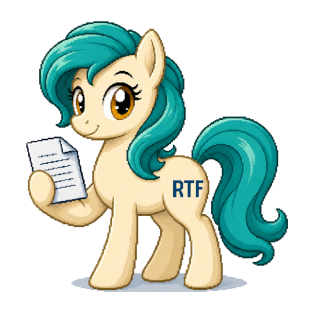

    

# MyLittleEditor

A simple RTF editor for Desktop.

## Why?

I wanted a small, fast application to edit text with a minimum of formatting.

RTF is a good old file format even it is not open (RTF is owned by Microsoft: https://en.wikipedia.org/wiki/Rich_Text_Format).

But there is no very light/simple application for GNU/Linux:

- All (Libre|Open|Microsoft|…)Office applications are too heavy for such a small format,
- AbiWord is small enough, but RTF is not the default format.

## This application

This application is made with FreePascal/Lazarus and use the [RichMemo LCL](https://wiki.freepascal.org/RichMemo).

**Warning: RichMemo is not installed by default, take a look to the freepascal wiki to install it. Otherwise you will not be able to compile the projet.**

## Credits

### RTF Lazarus component

[RichMemo](https://github.com/skalogryz/richmemo) from [Dmitry Boyarintsev](https://github.com/skalogryz) and other contributors.
RichMemo is released under the [LGPLv2](https://www.gnu.org/licenses/old-licenses/lgpl-2.0.html).

### Logo and icon

**Warning: The pony was generated by ChatGPT. I'm a developer not an artist so I use the tools I have access too when I need thing out of my scope.**

The icon files have been generated on [https://convertico.com/icon-maker/](https://convertico.com/icon-maker/).

## License

This project is licensed under the MIT License. See the LICENSE file for details.